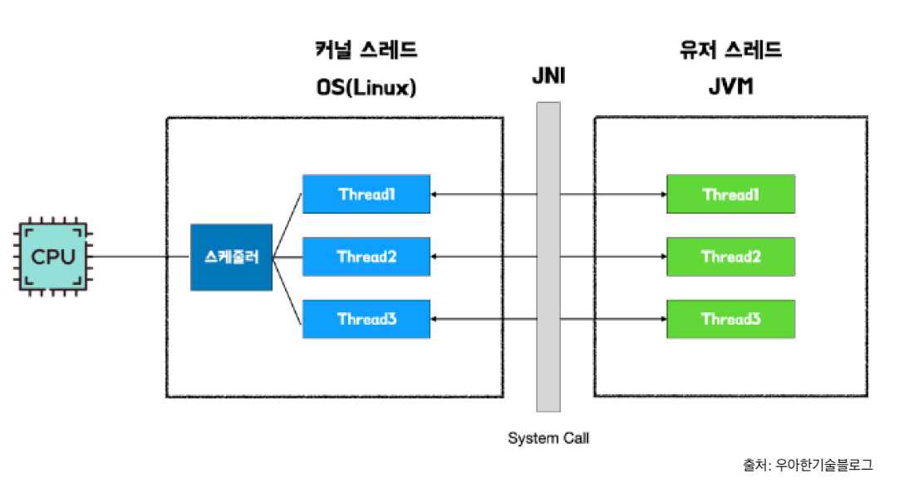
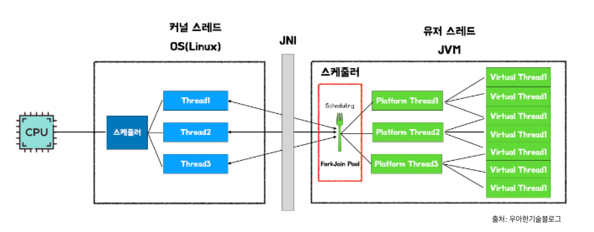
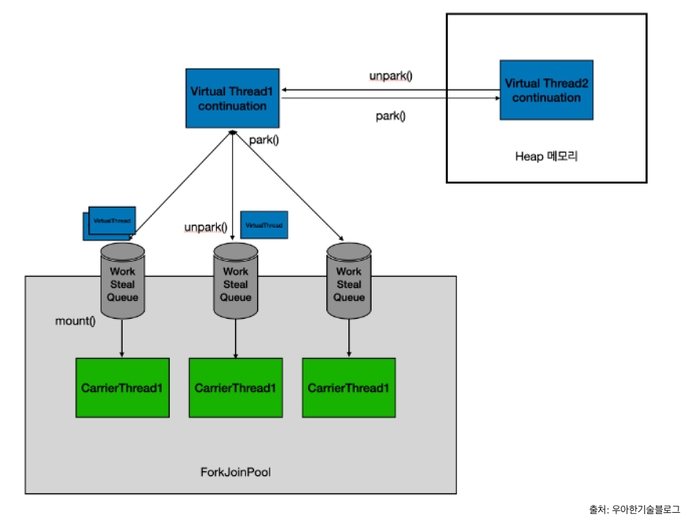

# Virtual Thread 개념
## Virtual Thread 란?
- Concurrency(동시성) 작업을 원할하게 하기 위한 경량 스레드
- 기존 스레드에 비해 컨텍스트 스위치 속도가 상대적으로 빨라 block 작업이 많은 환경에서 성능좋음 

## 기존 스레드의 문제점

- 기존 스레드는 OS의 커널 스레드에 매핑됨
- I/O, interrupt, sleep 시에 자바 스레드가 Block 상태가 되버림 -> OS의 커널 스레드가 다른 자바 스레드로 Context Switch
- I/O 작업이 많을경우 잦은 Context Switch로 속도 저하
- 스레드가 많을경우 OOM 가능성 있음

## Virtual Thread의 해결방법

- 기존 자바 스레드 = 플랫폼 스레드, 그 위에 버추얼 스레드가 동작
- 버추얼 스레드의 컨텍스트 스위치는 상대적으로 비용이 작아 컨텍스트 스위칭이 빈번한 작업에서 속도 개선

  |           | Thread | Virtual Thread |
  |-----------|--------|----------------|
  | Stack 사이즈 | ~2MB   | ~10KB          |
  | 생성시간      | ~1ms   | ~1μs           |
  | 컨텍스트 스위칭  | ~100μs | ~10μs          |

- Virtual Thread의 컨텍스트 스위치

1. Virtual Thread의 실행작업이 carrier thread에 배정되어 큐에 들어가게됨
2. Carrier Thread는 해당 작업을 진행하다가 block 발생시 park()하여 메모리에 저장
3. block이 풀릴때 unpark()하여 다시 큐에 들어가게됨

## Virtual Thread의 구현
- Virtual Thread는 기존 Thread의 상속받음
- Thread 내부의 메소드에서, Virual Thread의 경우 분기를 태움
```java
// Thread.java

public static void sleep(long millis) throws InterruptedException {
  if (millis < 0) {
    throw new IllegalArgumentException("timeout value is negative");
  }

  long nanos = MILLISECONDS.toNanos(millis);
  ThreadSleepEvent event = beforeSleep(nanos);
  try {
    if (currentThread() instanceof VirtualThread vthread) {
      vthread.sleepNanos(nanos);
    } else {
      sleep0(nanos);
    }
  } finally {
    afterSleep(event);
  }
}
```
- Spring Web MVC의 경우, Virtual Thread가 ON되면 해당하는 executor를 별도로 만들어줌
```java
// org.springframework.boot.autoconfigure.web.embedded.EmbeddedWebServerFactoryCustomizerAutoConfiguration.java

@Configuration(
        proxyBeanMethods = false
)
@ConditionalOnClass({Tomcat.class, UpgradeProtocol.class})
public static class TomcatWebServerFactoryCustomizerConfiguration {
  public TomcatWebServerFactoryCustomizerConfiguration() {
  }

  @Bean
  public TomcatWebServerFactoryCustomizer tomcatWebServerFactoryCustomizer(Environment environment, ServerProperties serverProperties) {
    return new TomcatWebServerFactoryCustomizer(environment, serverProperties);
  }

  @Bean
  @ConditionalOnThreading(Threading.VIRTUAL)
  TomcatVirtualThreadsWebServerFactoryCustomizer tomcatVirtualThreadsProtocolHandlerCustomizer() {
    return new TomcatVirtualThreadsWebServerFactoryCustomizer();
  }
}

// org.springframework.boot.autoconfigure.web.embedded.TomcatVirtualThreadsWebServerFactoryCustomizer.java

public void customize(ConfigurableTomcatWebServerFactory factory) {
  factory.addProtocolHandlerCustomizers(new TomcatProtocolHandlerCustomizer[]{(protocolHandler) -> {
    protocolHandler.setExecutor(new VirtualThreadExecutor("tomcat-handler-"));
  }});
}

// org.apache.tomcat.util.threads.VirtualThreadExecutor.java

public VirtualThreadExecutor(String namePrefix) {
  this.threadBuilder = this.jreCompat.createVirtualThreadBuilder(namePrefix);
}

```

## 버추얼 스레드 주의사항
- No pooling : 생성비용이 작기떄문에 스레드 풀 만드는 행위 자체가 낭비가 될수 있음
- Thread Local 
  - Virtual Thread는 Thread Local을 지원하지만, 
  - 용량이 큰 객체를 Thread Local 에 저장하지 않는것이 좋음
  - Virtual Thread가 무거우면 Context Switch 비용이 늘어남 -> 원래 존재의 이유가 사라짐
- CPU bound 작업엔 비효율적
  - CPU 작업만 수행할 경우 플랫폼 스레드 사용하는것보다 효율이 떨어짐 
  - 플랙폼 스레드 + Virtual Thread 사용 비용이 추가됨
  - IO bound 에 집중되는 작업에 사용
- Pinned Issue
  - synchronized, parallelStream 사용 시, virtual Thread가 carrier thread에 고정되는 상태로 작동해 성능이 저하됨
  - lock 이 필요한 경우에 ReentrantLock으로 대체 고려 필요

# 부하 테스트 해보자!

## 테스트 시나리오
- Spring Web MVC서버의 API 호출, [MvcApplication.java](mvc/src/main/java/org/example/mvc/MvcApplication.java)
  - 외부 서버에 2번 호출 이후 DB에 저장
  - 순간 강한 부하를 주어 응답속도를 비교

## 테스트 환경 구성
- Java 21 사용!
- [로드 테스트 Tool 준비!](#로드-테스트-Tool)
- 외부 서버 띄우기
```bash
./gradlew :external:bootRun

# 서버 올라갔는지 확인
curltime  -X GET http://localhost:19101?delay=1000
```

- mvc 서버 띄우기, Virtual Thread X
```bash
./gradlew :mvc:bootRun -Dspring.threads.virtual.enabled=false -Dserver.port=19001

# 서버 올라갔는지 확인
curltime  -X GET http://localhost:19001?delay=1000
```
포트 별도로 띄우자

- mvc 서버 띄우기, Virtual Thread O
```bash
./gradlew :mvc:bootRun -Dspring.threads.virtual.enabled=true -Dserver.port=19002

# 서버 올라갔는지 확인
curltime  -X GET http://localhost:19002?delay=1000 
```

## 테스트 수행
- 500개의 클라이언트로 1000번 요청 수행
- 주의: 처음 테스트는 아직 초기화가 제대로 안된상태라서, 성능이 떨어지게 나올수 있음
```bash
# Virtual Thread X
baton -m GET -u http://localhost:19001?delay\=100 -c 500 -r 1000

# Virtual Thread O
baton -m GET -u http://localhost:19002?delay\=100 -c 500 -r 1000
```

## 테스트 결과
| Virtual Thread | X | O |
  |----------------|------------------|------------------|
| 최대 응답시간(ms)    | 631              | 409             |
| 최소 응답시간(ms)    | 204              | 205             |
| 평균 응답시간(ms)    | 512.74           | 320.83           |
- 평균 응답시간 기준 약 1.6배 성능 좋아짐

# 로드 테스트 Tool
- curltime : curl 소요 시간 확인
```bash
# 사용하는 쉘에 따라 alias 추가: `~/.bash_profile` or `~/.zshrc`
add alias `alias curltime="curl -w \"@$HOME/.curl-format.txt\" -o NUL -s "`

# 테스트: 네이버 한번 해보기
curltime www.naver.com

# 결과
TOTAL TIME:  0.043264s
===========================
```
- baton : 간단한 부하 테스트 tool
```bash
# install go
brew update
brew install go

# baton 설치
go install github.com/americanexpress/baton@latest
```
- OS 환경변수의 PATH에 go의 bin(/Users/user/go/bin)의 path 추가 
  - go의 bin path는 `go env` 로 `$GOPATH` 확인 후, 들어가서 내부 bin 폴더 있는지 확인

```bash
# 설치 완료 후 테스트
baton -m GET -u https://www.naver.com -c 1 -r 10
```

# Reference
- https://techblog.woowahan.com/15398/
- https://mangkyu.tistory.com/317
- https://www.youtube.com/watch?v=szl3eWA0VRw
- https://wiki.linecorp.com/pages/viewpage.action?pageId=3538751138